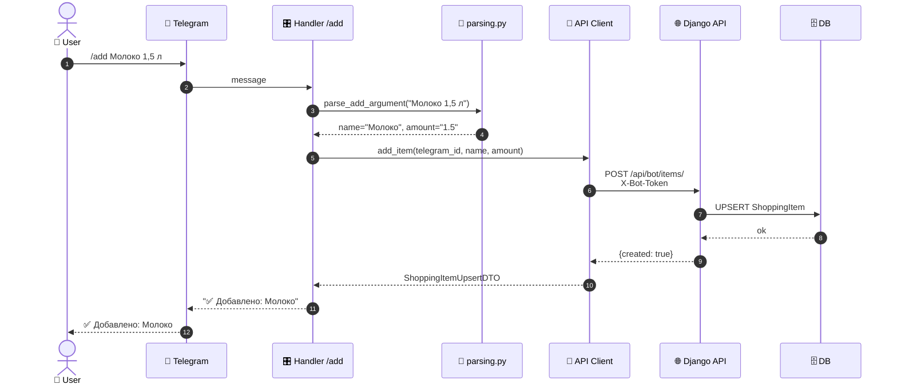

## 3. Sequence — `/add`

**Что показывает:** как проходит команда `/add` через слои.

```mermaid
sequenceDiagram
    autonumber
    actor U as 👤 User
    participant TG as 📱 Telegram
    participant H as 🎛️ Handler /add
    participant P as 🧩 parsing.py
    participant C as 🔌 API Client
    participant API as 🌐 Django API
    participant DB as 🗄️ DB

    U->>TG: /add Молоко 1,5 л
    TG->>H: message
    H->>P: parse_add_argument("Молоко 1,5 л")
    P-->>H: name="Молоко", amount="1.5"
    H->>C: add_item(telegram_id, name, amount)
    C->>API: POST /api/bot/items/<br/>X-Bot-Token
    API->>DB: UPSERT ShoppingItem
    DB-->>API: ok
    API-->>C: {created: true}
    C-->>H: ShoppingItemUpsertDTO
    H-->>TG: "✅ Добавлено: Молоко"
    TG-->>U: ✅ Добавлено: Молоко
```