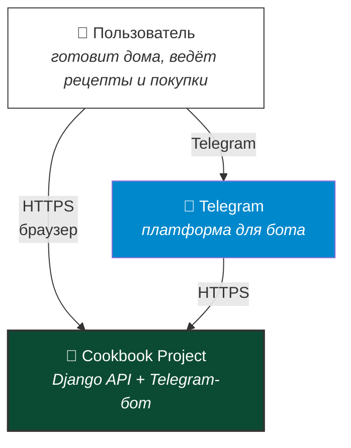

# C4 Context — Cookbook Project

> Один пользователь, две точки входа: браузер и Telegram.

```mermaid
graph TB
    User["👤 Пользователь<br/><i>готовит дома, ведёт рецепты и покупки</i>"]
    
    Cookbook["🍳 Cookbook Project<br/><i>Django API + Telegram-бот</i>"]
    
    TG["📱 Telegram<br/><i>платформа для бота</i>"]
    
    User -->|"HTTPS<br/>браузер"| Cookbook
    User -->|"Telegram"| TG
    TG -->|"HTTPS"| Cookbook
    
    style Cookbook fill:#0C4B33,color:#fff,stroke:#333,stroke-width:2px
    style TG fill:#0088cc,color:#fff
    style User fill:#fff,stroke:#333
```