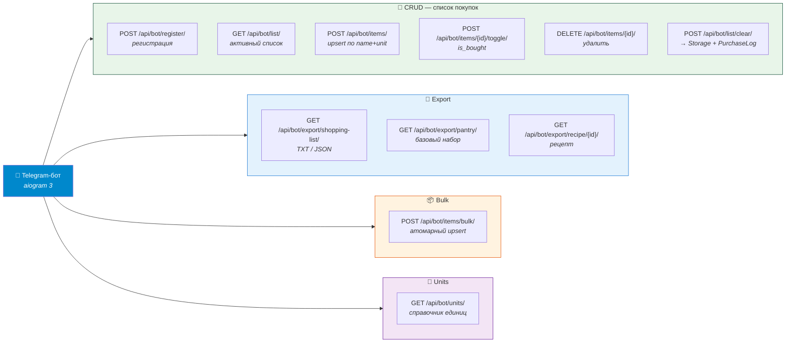

# Карта Bot API — 11 эндпоинтов

> Django API для Telegram-бота. Авторизация: `X-Bot-Token`.
> Полный контракт: `API_CONTRACT.md` v1.17.

```mermaid
graph LR
    Bot["🤖 Telegram-бот<br/><i>aiogram 3</i>"]
    
    subgraph CRUD["🛒 CRUD — список покупок"]
        R["POST /api/bot/register/<br/><i>регистрация</i>"]
        L["GET /api/bot/list/<br/><i>активный список</i>"]
        A["POST /api/bot/items/<br/><i>upsert по name+unit</i>"]
        T["POST /api/bot/items/{id}/toggle/<br/><i>is_bought</i>"]
        D["DELETE /api/bot/items/{id}/<br/><i>удалить</i>"]
        C["POST /api/bot/list/clear/<br/><i>→ Storage + PurchaseLog</i>"]
    end
    
    subgraph EXPORT["📄 Export"]
        E1["GET /api/bot/export/shopping-list/<br/><i>TXT / JSON</i>"]
        E2["GET /api/bot/export/pantry/<br/><i>базовый набор</i>"]
        E3["GET /api/bot/export/recipe/{id}/<br/><i>рецепт</i>"]
    end
    
    subgraph BULK["📦 Bulk"]
        B["POST /api/bot/items/bulk/<br/><i>атомарный upsert</i>"]
    end
    
    subgraph UNITS["📏 Units"]
        U["GET /api/bot/units/<br/><i>справочник единиц</i>"]
    end
    
    Bot --> CRUD
    Bot --> EXPORT
    Bot --> BULK
    Bot --> UNITS
    
    style Bot fill:#0088cc,color:#fff
    style CRUD fill:#E8F5E9,stroke:#0C4B33
    style EXPORT fill:#E3F2FD,stroke:#1976D2
    style BULK fill:#FFF3E0,stroke:#E65100
    style UNITS fill:#F3E5F5,stroke:#6A1B9A
```